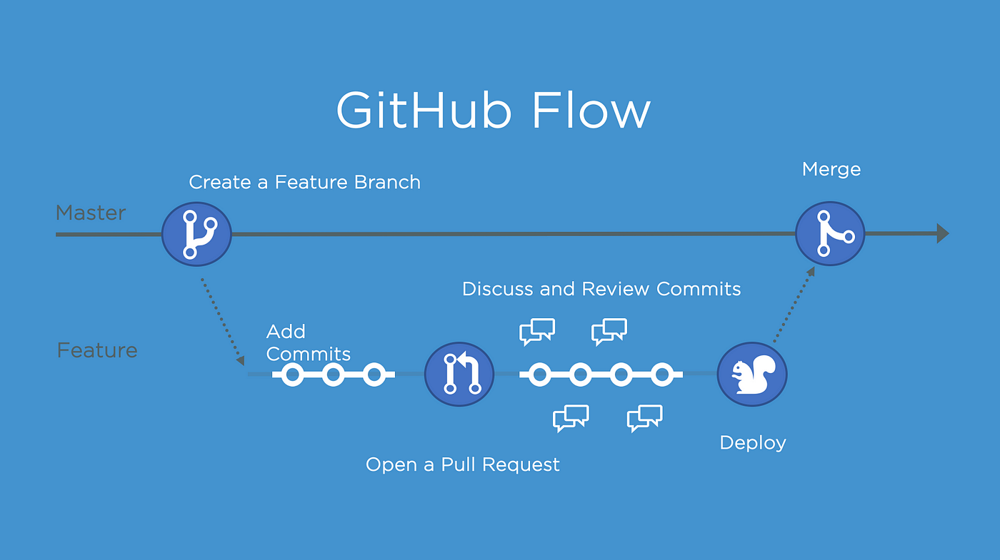

# Github Action CI/CD

## Yêu cầu Dự án:
Biết được cách sử dụng công cụ CI/CD như Github Actions.

## Mô tả Dự án:

### Sơ đồ Mô phỏng Quá trình:
- Flow thực hiện quá trình CI/CD tự động từ build code, tự động hóa, deploy

### Trình bày về Quá trình CI/CD:

Quá trình CI/CD (Continuous Integration/Continuous Deployment) là một phương pháp tiếp cận để tự động hóa các giai đoạn từ xây dựng mã nguồn đến triển khai ứng dụng. Với Github Actions, chúng ta có thể thiết lập các workflow để quản lý quá trình này một cách tự động và hiệu quả.

1. **Continuous Integration (CI):** 
   - **Build:** Mỗi khi có thay đổi trong mã nguồn, hệ thống sẽ tự động kiểm tra và xây dựng lại ứng dụng. Điều này giúp phát hiện sớm lỗi và đảm bảo rằng mã nguồn mới luôn hoạt động đúng.
   - **Test:** Sau khi xây dựng, hệ thống sẽ tự động chạy các bài kiểm tra để đảm bảo rằng mọi chức năng hoạt động đúng như mong đợi.

2. **Continuous Deployment (CD):**
   - **Deploy:** Khi tất cả các bài kiểm tra đều thành công, mã nguồn mới sẽ được tự động triển khai lên môi trường sản xuất hoặc staging. Điều này giúp giảm thiểu thời gian và công sức của việc triển khai thủ công, đồng thời đảm bảo rằng ứng dụng luôn được cập nhật.

3. **Automation:** 
   - **Automation Scripts:** Sử dụng các tập lệnh tự động để thực hiện các bước cần thiết trong quá trình CI/CD. Github Actions cho phép định nghĩa các workflow dưới dạng các tập tin YAML, giúp dễ dàng tùy chỉnh và mở rộng.

### Kết luận:

Việc sử dụng Github Actions cho CI/CD không chỉ giúp tự động hóa quá trình phát triển và triển khai phần mềm mà còn giúp nâng cao chất lượng mã nguồn và hiệu suất làm việc của đội ngũ phát triển. Với sơ đồ mô phỏng quá trình CI/CD, ta có cái nhìn tổng quan về các bước cần thiết và cách chúng hoạt động cùng nhau để mang lại sản phẩm cuối cùng một cách nhanh chóng và hiệu quả.
